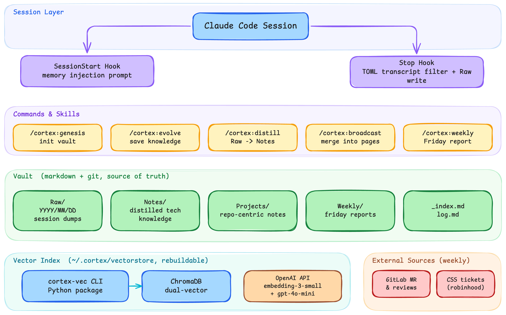

# Cortex

Personal knowledge vault plugin for Claude Code — session recording, memory distillation, semantic retrieval, weekly reports.



## What It Does

Cortex 把你的工作記憶變成可搜尋的知識庫。每次 Claude Code session 結束時自動記錄，之後可以提煉、檢索、產生週報。

- **自動記錄** — session 結束時產出完整報告（commits、發現、決策），存到 vault
- **語意搜尋** — 用 OpenAI embedding + ChromaDB，中英文混合搜尋
- **知識提煉** — 從 Raw session dump 萃取踩坑知識、內部慣例、關鍵決策
- **Memory Injection** — 開 session 時偵測當前 repo，詢問是否載入相關記憶

**設計哲學：** Vault 是 source of truth（純 markdown + git），vector store 是可重建的衍生索引。

## Quick Start

### 1. 安裝 plugin

```bash
# 從 GitLab
/plugin marketplace add git@git.synology.inc:tonyhu/cortex.git#plugin

# 從 GitHub
/plugin marketplace add https://github.com/XBlueSky/cortex.git#plugin
```

### 2. 安裝 cortex-vec CLI

```bash
pip install -e "$(claude plugin root cortex)/cortex-vec"
```

需要 `OPENAI_API_KEY` 環境變數（用於 embedding）。

### 3. 初始化

```bash
/cortex:genesis /path/to/your/vault
```

這會設定 vault 路徑、author 資訊，並建立語意索引。

### 4. 開始使用

```
「存到 cortex」     → 手動存入知識
「查 cortex」       → 語意搜尋 vault
「提煉」           → 從 Raw/ 萃取知識
「broadcast」      → 把新 Raw 融合進既有頁面
「整理週報」       → 產生週報
```

## Commands & Skills

### Commands

| Command | Description |
|---------|-------------|
| `/cortex:genesis` | 初始化 vault — 設定路徑、author、重建索引 |
| `/cortex:evolve` | 手動存入知識到 Notes 或 Projects（同時寫 `log.md`） |
| `/cortex:distill` | 提煉 Raw/ session 記錄到 Notes/Projects（兩階段評估 + pending-merge 出口） |
| `/cortex:broadcast` | 把新 distill 的內容融合進相關既有頁面（llm-wiki 式 ingest） |
| `/cortex:weekly` | 產 Friday 週報（distill + GitLab activity + CSS tickets） |

### Skills（自動觸發）

| Skill | Trigger |
|-------|---------|
| cortex-evolve | 「存到 cortex」「記一下」「save to cortex」 |
| cortex-distill | 「提煉」「整理 raw」「distill」 |
| cortex-broadcast | 「broadcast」「merge pending-merge」「把這個融入 vault」 |
| cortex-weekly | 「整理週報」「產生週報」「weekly report」 |
| cortex-query | 「查 cortex」「之前有記過」「cortex 裡有沒有」 |

### Hooks

| Hook | Event | Behavior |
|------|-------|----------|
| Session Report | Stop | session 結束時先經 TOML transcript filter 過濾，再寫到 Raw/ |
| Memory Injection | SessionStart | 互動式選單：偵測 vault 狀態（週報/backlog）後詢問下一步 |

#### Transcript Filter（0.9.0+）

Stop hook 在寫進 Raw/ 前會跑一條 TOML-driven filter pipeline，把不具知識價值的
tool 輸出（例如 `ls`、卷冊清單、重複的 build log）過濾掉——你可以針對個別 slash
command 寫客製 filter，讓 Raw 存下來的是真正有訊號的內容。

## Architecture

```
cortex repo
├── plugin branch (orphan)     ← Claude Code plugin（本檔案所在）
└── main branch                ← Obsidian vault 資料

~/.cortex/
├── config.json                ← genesis 產生的設定
└── vectorstore/               ← ChromaDB 語意索引（local only，不在 git）
```

### Vault Structure

```
Raw/YYYY/MM/DD/                ← session dumps（完整，按需提煉）
Notes/<category>/              ← 提煉後的技術知識
Projects/<repo-name>/          ← 以 repo 為主的專案筆記
Weekly/YYYY/                   ← 整理後的週報
_index.md                      ← 全 vault 摘要索引
log.md                         ← evolve/distill 的時序歷程
```

### Data Flow

```
每個 session:
  SessionStart → 提示有 memory 可用 → 使用者決定是否載入
  工作...
  session 結束 → Stop hook → 確認 → Raw/

隨時:
  /cortex:evolve    → Notes/Projects + _index.md + log.md + vector store
  /cortex:query     → vector search → 精確讀檔

定期:
  /cortex:distill   → Raw → Notes/Projects (+ pending-merge → broadcast)
  /cortex:broadcast → pending-merge → 融合進既有 Notes/Projects
  /cortex:weekly    → distill + GitLab + CSS → Weekly/
```

### Retrieval Strategy

**Hybrid 檢索**（0.4.0+）— BM25 + vector 雙流，以 Reciprocal Rank Fusion（RRF, k=60）融合，預設權重 w_bm25=0.4 / w_vec=0.6：

- **BM25 流** — 精確詞彙匹配（函數名、repo 名、issue ID 等），搭配 jieba CJK 分詞支援中英混合查詢。索引持久化於 `~/.cortex/bm25/`，由 `rebuild`/`upsert`/`delete` 與 ChromaDB 保持同步。
- **Vector 流** — OpenAI `text-embedding-3-small` 語意搜尋，dual-vector（文件 body + 雙語 summary），覆蓋語意相近但詞彙不同的場景。
- **降級策略** — 未設定 `OPENAI_API_KEY` 或離線時，自動退化為 BM25-only，不再依賴 skill-layer grep fallback。

其他分層：

1. **Raw Search**（按需）— 只在追溯時查詢原始 session 記錄

## cortex-vec CLI

Vault 的語意索引工具，用 ChromaDB + OpenAI `text-embedding-3-small`，搭配
`gpt-5.4-mini` 產雙語 summary 作為第二組 embedding（dual-vector）以提升中英混合
查詢的 recall。

```bash
cortex-vec status                          # 查看索引狀態
cortex-vec rebuild                         # 完整重建索引
cortex-vec search "nginx certificate"      # 語意搜尋
cortex-vec search "oauth" --repo libsynow3 # 按 repo 過濾
cortex-vec search "sharing" --type project # 按類型過濾
cortex-vec upsert Notes/Nginx/new.md       # 新增/更新單一文件
cortex-vec delete Notes/Nginx/old.md       # 刪除文件
```

### Hybrid 檢索（0.4.0+）

`cortex-vec search` 現在預設走 BM25 + vector RRF hybrid，兼顧精確詞彙與語意相似度：

```bash
cortex-vec search "nginx certificate"           # hybrid（預設）
cortex-vec search "nginx certificate" --no-bm25 # 只走 vector（debug/eval 用）
cortex-vec search "nginx certificate" --no-vector # 只走 BM25（debug/eval 用）
cortex-vec status                               # 同時顯示 vector 與 BM25 entry 數量
```

### 檢索評測

```bash
# Step 1：讓 LLM 草擬候選查詢，人工審閱並確認 gold paths 後才能使用
cortex-vec eval propose --queries eval-data/cortex-vault-v1.jsonl

# Step 2：跑所有 adapter，印出 NDJSON 結果，並寫 markdown 評分表
cortex-vec eval run \
  --queries eval-data/cortex-vault-v1.jsonl \
  --adapters grep,vector,bm25,hybrid \
  --k 5 \
  --out docs/benchmarks/$(date +%Y-%m-%d)-cortex-vault-v1.md
```

支援的 adapter：`grep` / `vector` / `bm25` / `hybrid`。
評測指標：P@5 / R@5 / MRR / hit。

### 進階檢索（Plan 2，預設關閉）

以下四項增強功能預設全部關閉，需明確設定才會啟用。**開啟前後請務必用 `cortex-vec eval run` 量測 P@5 / R@5 / MRR 的 lift**，再決定哪些值得設為預設開啟、哪些應該回退。

#### Synonym 展開

由 config `retrieval.synonym_weight`（`0` = 關閉；建議試 `0.7`）控制。BM25 流會把命中同義詞的文件以該權重加分，讓「OAuth」可以命中「SSO / 授權 / auth」等同義詞。

同義詞表位於 `cortex-vec/src/cortex_vec/synonyms.py`（內含 Synology 黑話 + 常見中英技術詞），可自行擴充。

#### Wikilink graph-boost

透過 `cortex-vec search --graph`（或 config `retrieval.graph: true`）啟用。利用 vault 既有的 `[[wikilinks]]` 把「命中結果的鄰居頁面」加分，讓相關聯的筆記更容易浮現。

可調整的細部參數：`retrieval.graph_hops`（傳播跳數）、`retrieval.graph_weight`（加權強度）、`retrieval.graph_top_k`（取前幾筆命中當作 BFS 種子，從這些種子的鄰居加分；非最終回傳筆數）。

> **注意**：`graph_weight` 預設 `0.1`，相對 RRF 分數（量級約 0.01）偏強，實際效果因 vault 結構而異，請以 eval 結果為準再調整。

#### LLM rerank

透過 `cortex-vec search --rerank`（或 config `retrieval.rerank: true`）啟用。對初步 hybrid 結果的前 `retrieval.rerank_window`（預設 15）筆，呼叫 OpenAI（model 由 `retrieval.rerank_model` 指定，預設 `gpt-5.4-mini`）重新排序，以 LLM 判斷相關性取代純分數排名。任何失敗（API error / timeout）均自動回退原 RRF 順序，不影響搜尋可用性。

#### max-per-repo 多樣化

由 config `retrieval.max_per_repo`（`0` = 不限）控制，限制同一 repo 在前 k 結果中最多出現幾筆，避免某個大型 repo 淹沒其他來源的結果。

#### 完整 `retrieval` 設定範例

以下為 `~/.cortex/config.json` 中 `retrieval` 區塊的所有 Plan 2 新鍵與其預設值：

```json
{
  "retrieval": {
    "synonym_weight": 0,
    "graph": false,
    "graph_hops": 1,
    "graph_weight": 0.1,
    "graph_top_k": 5,
    "rerank": false,
    "rerank_model": "gpt-5.4-mini",
    "rerank_window": 15,
    "max_per_repo": 0
  }
}
```

搭配 CLI flag 的用法：

```bash
# 開啟 graph-boost + rerank（一次性測試）
cortex-vec search "OAuth token" --graph --rerank

# 設定 synonym_weight 後跑 eval 確認 lift
cortex-vec eval run \
  --queries eval-data/cortex-vault-v1.jsonl \
  --adapters hybrid \
  --k 5 \
  --out docs/benchmarks/$(date +%Y-%m-%d)-synonym-0.7.md
```

## Configuration

`~/.cortex/config.json`（由 genesis 產生）：

```json
{
  "vault_path": "/path/to/vault",
  "author": "tonyhu",
  "author_email": "tonyhu@synology.com",
  "git": {
    "auto_commit": true,
    "auto_push": false
  },
  "weekly": {
    "gitlab_username": "tonyhu",
    "categories": ["fix", "feat", "misc"]
  }
}
```

### Environment Variables

| Variable | Required | Description |
|----------|:--------:|-------------|
| `OPENAI_API_KEY` | No* | OpenAI API key，用於 text-embedding-3-small。`rebuild`/`upsert`/vector 搜尋時必填；未設定時 `search` 自動降級為 BM25-only |
| `CORTEX_VAULT_PATH` | No | 覆蓋 config.json 的 vault_path |

## Dependencies

| Package | Purpose |
|---------|---------|
| [ChromaDB](https://www.trychroma.com/) | 語意向量索引 |
| [OpenAI](https://platform.openai.com/) | text-embedding-3-small embedding model |
| [python-frontmatter](https://python-frontmatter.readthedocs.io/) | YAML frontmatter 解析 |
| pysqlite3-binary | SQLite 3.35+ 相容（系統 SQLite 太舊時需要） |

安裝：

```bash
pip install -e ./cortex-vec
```

## Changelog

See [CHANGELOG.md](CHANGELOG.md) for version history.

## License

Licensed under the [Apache License 2.0](LICENSE) — see `LICENSE` for full text.
